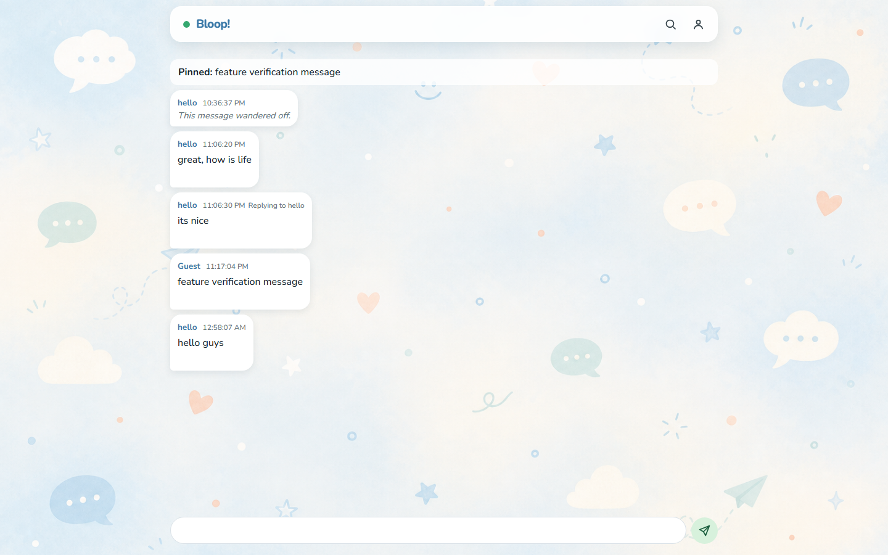
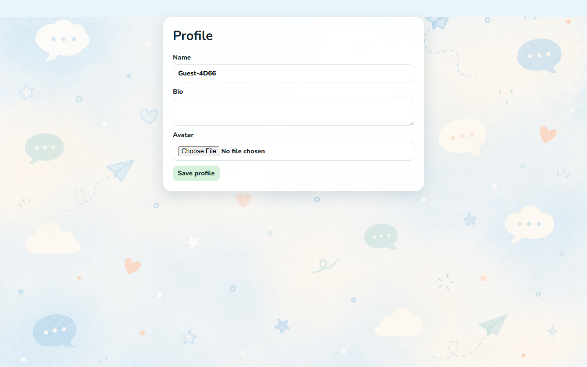

# Bloop!

> A production-minded real-time chatroom built to make the hard parts visible: identity without signup, room isolation, distributed presence, and private-room encryption.



## Why this project exists

Most chat demos stop at “messages appear in another tab.” Bloop is an intentionally small product that goes further: it treats a real-time chatroom as a systems problem. That means server-enforced ownership, durable messages, reconnect behavior, session cookies, room capacity, moderation controls, and a clear security boundary for a private room.

The result is a playful interface with a serious implementation underneath.



## Product highlights

- Two isolated rooms: public and password-gated private.
- Persistent guest identities—no email or account creation required.
- Live messages, replies, reactions, typing, online presence, pinning, edits, and soft deletion.
- Message controls that adapt to pointer and touch interactions.
- Profile editing with validated local avatar uploads.
- Configurable room availability, capacity, moderation, retention, reporting, and audit events.
- Independent 30-session capacity enforcement per room.
- Private-room message encryption in the browser using AES-256-GCM.

## Architecture at a glance

```text
React + Vite                         Fastify + ws
Browser ── HTTPS / WebSocket ──────> API / realtime gateway
   │                                      │
   │ secure HTTP-only session cookie       ├── Prisma ──> PostgreSQL
   │                                      └── Redis ───> presence, leases, fan-out
   │
   └── private room: PBKDF2 key derivation + AES-GCM encrypt/decrypt locally
```

| Area                       | Implementation                                                               |
| -------------------------- | ---------------------------------------------------------------------------- |
| Frontend                   | React, Vite, React Router, TypeScript                                        |
| API and realtime           | Fastify, `ws`, Zod, TypeScript                                               |
| Persistence                | PostgreSQL + Prisma                                                          |
| Distributed realtime state | Redis session leases, presence, pub/sub fan-out                              |
| Authentication             | Opaque, signed HTTP-only cookie with hashed session token in the database    |
| Private access             | Argon2id password verification, short-lived session-scoped access record     |
| Private content            | Browser-side AES-256-GCM ciphertext envelopes; server stores ciphertext only |
| Quality gates              | ESLint, Prettier, TypeScript, Vitest, Docker Compose, GitHub Actions         |

## Engineering decisions that matter

### Guest identity, not a fake username login

On first API use, the server creates a guest user and an opaque session token. The browser receives only the signed, HTTP-only cookie; PostgreSQL stores a SHA-256 hash of the token. Display names are purely profile data, never authorization.

This keeps onboarding friction low without letting a client claim another user’s messages by submitting a different user ID.

### Room isolation is enforced at the server boundary

The WebSocket client can request a room, but the server resolves the session, verifies private access, scopes all message queries by the joined room, and rejects cross-room operations. Presence, typing state, capacity, history, and broadcasts are room-specific.

### Capacity is a distributed concern

The 30-user limit is not a frontend counter. Redis maintains room-session leases and distributes realtime events, so multiple server instances can agree on room capacity and presence. PostgreSQL remains the durable record; Redis handles fast, ephemeral coordination.

### Private-room encryption has an intentional boundary

The private password is verified by the server with Argon2id, then independently used in the browser to derive a non-persisted AES-256-GCM key. Private messages and edits are encrypted before they leave the browser. The server relays and stores ciphertext, and private server-side search is disabled.

This is deliberately not “security theatre.” It also means private content cannot be recovered, searched, or edited by an administrator. After a full page refresh, the password must be entered again to restore the in-memory key.

### Deletion preserves UX without retaining content

Messages are soft deleted for a stable conversation timeline, but their content is nulled. Clients show a clear deleted-message placeholder, and deleted messages cannot be edited again.

## Tradeoffs and what I would do next

| Decision                            | Why                                                   | Tradeoff / next step                                                                 |
| ----------------------------------- | ----------------------------------------------------- | ------------------------------------------------------------------------------------ |
| Shared-password private room        | Fast, low-friction private collaboration              | Move to per-user public keys and group-key rotation for revocable membership         |
| Browser-memory encryption key       | Password is never persisted                           | Refresh requires re-entering the password                                            |
| Local avatar storage in development | Easy local setup                                      | Use object storage, signed uploads, malware scanning, and CDN delivery in production |
| Redis for ephemeral state           | Scales presence and broadcasts beyond one server      | Operate managed Redis with replication, alerts, and capacity planning                |
| Server-side public search only      | Useful discovery without weakening private encryption | Add client-side encrypted search indexing if private search becomes a requirement    |
| Admin can delete private ciphertext | Keeps abuse response possible                         | Admin cannot inspect or edit encrypted private content by design                     |

## Problems solved along the way

- **WebSocket reconnect loops:** lifecycle handling now caps retries, distinguishes deliberate disconnects, and supports manual reconnection.
- **Multi-instance room limits:** moved room-session capacity from process memory to Redis leases.
- **Private encryption payload size:** AES-GCM ciphertext is larger than plaintext, so the message column and migration allow up to 4096 characters while client plaintext remains limited to 500.
- **Touch versus pointer interaction:** a tap reveals reactions; a long press selects a message; desktop hover and click behavior stay intentional.
- **Strict Mode duplicate sockets:** the client hook cleans up sockets and retry timers safely.
- **Historical ownership:** profile edits update public profile data without rewriting message authorship.

## Repository layout

```text
apps/
  web/                 React/Vite client
  server/              Fastify API, WebSocket server, Prisma schema
packages/
  shared/              Cross-runtime Zod schemas and event contracts
docs/images/           README screenshots captured from the running app
docker-compose.yml     Local PostgreSQL, Redis, server, and web stack
```

## Run it locally

### Prerequisites

- Node.js 20+
- pnpm 9+
- Docker Desktop / Docker Compose

### 1. Configure secrets

```powershell
Copy-Item .env.example .env
pnpm.cmd install
pnpm.cmd --filter @chatroom/server password:hash "choose-a-shared-private-password"
```

Copy the printed hash into `PRIVATE_ROOM_PASSWORD_HASH` in `.env`. Also replace the example `SESSION_SECRET` and `ADMIN_SECRET` with strong random values.

### 2. Start the complete local stack

```powershell
docker compose up -d --build
```

Open [http://127.0.0.1:5173](http://127.0.0.1:5173). Health and readiness endpoints are available at:

```text
http://127.0.0.1:3000/api/health
http://127.0.0.1:3000/api/ready
```

### Development mode

```powershell
docker compose up -d postgres redis
pnpm.cmd --filter @chatroom/server prisma:migrate
pnpm.cmd dev
```

## Environment variables

| Variable                     | Purpose                                                     |
| ---------------------------- | ----------------------------------------------------------- |
| `DATABASE_URL`               | PostgreSQL connection string                                |
| `REDIS_URL`                  | Shared Redis endpoint for leases, presence, and fan-out     |
| `SESSION_SECRET`             | Signs opaque session cookies                                |
| `ADMIN_SECRET`               | Protects the admin session flow                             |
| `PRIVATE_ROOM_PASSWORD_HASH` | Argon2id hash of the shared private password                |
| `PUBLIC_ORIGIN`              | Allowed browser origin for CORS and WebSocket upgrades      |
| `SERVER_PORT`                | Fastify listener port                                       |
| `AVATAR_UPLOAD_DIR`          | Development filesystem avatar location                      |
| `NODE_ENV`                   | Enables production cookie behavior when set to `production` |

## Verification and production build

```powershell
pnpm.cmd format:check
pnpm.cmd lint
pnpm.cmd typecheck
pnpm.cmd test
pnpm.cmd build
```

The test suite covers shared protocol validation, session/profile behavior, message retention, and private encryption round trips—including failure with an incorrect password.

## Security posture

- Every HTTP payload and WebSocket event is validated with Zod.
- WebSocket upgrades require a valid session cookie and exact allowed origin.
- Session tokens are cryptographically random; only their hashes reach the database.
- Cookies are HTTP-only, SameSite=Lax, and Secure in production.
- Password attempts, message sends, payload size, uploads, and room capacity are server-limited.
- Avatar uploads are content-inspected, size-limited, server-named, and served from a controlled route.
- Message ownership is always checked by server-resolved identity and currently joined room.
- Private message ciphertext is not logged, searched, or decrypted by the server.

Rotate the shared private password immediately if it is leaked. Rotation changes the browser-derived room key; plan a dedicated key migration workflow before relying on encrypted historical archives.

## Production readiness checklist

- Terminate TLS before the application and set `NODE_ENV=production`.
- Use managed PostgreSQL and Redis with backups, replication, monitoring, and alerting.
- Run Prisma migrations as a deployment step, not from a web request.
- Replace local avatars with object storage and a CDN.
- Add browser-level Playwright coverage for private unlock, reconnect, and full room capacity.
- Add observability for WebSocket churn, Redis lease failures, slow queries, and rate-limit events.

---

Built as a focused systems project: delightful enough to use, rigorous enough to discuss in an engineering interview.
